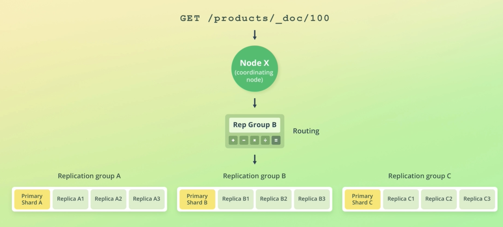
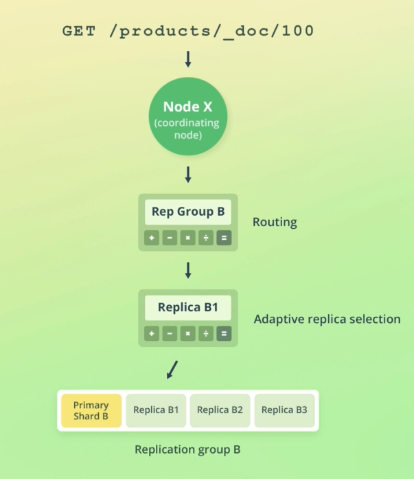
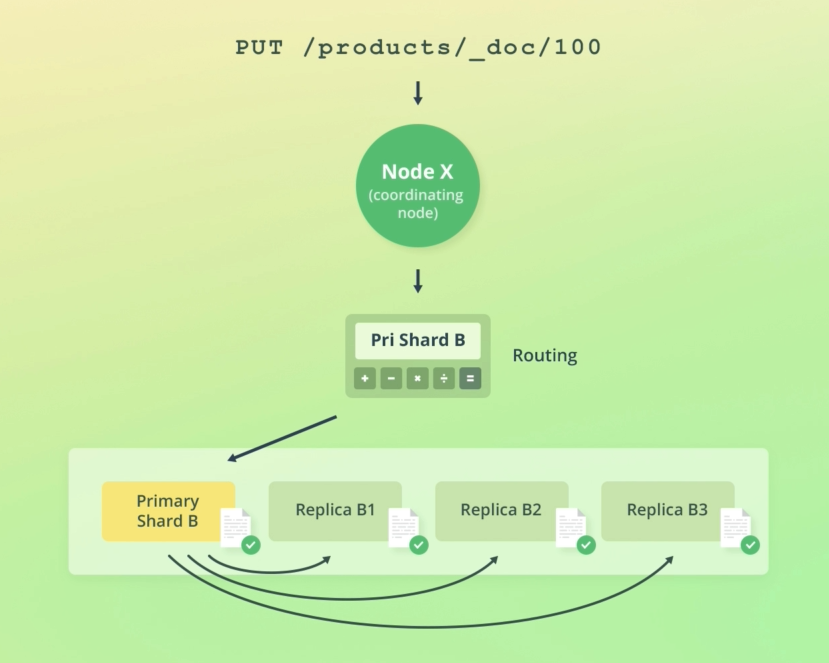

# Elastic Search REST API through kibana

To check for health

```shell
$ GET /_cluster/health
{
  "cluster_name" : "docker-cluster",
  "status" : "green",
  "timed_out" : false,
  "number_of_nodes" : 1,
  "number_of_data_nodes" : 1,
  "active_primary_shards" : 5,
  "active_shards" : 5,
  "relocating_shards" : 0,
  "initializing_shards" : 0,
  "unassigned_shards" : 0,
  "delayed_unassigned_shards" : 0,
  "number_of_pending_tasks" : 0,
  "number_of_in_flight_fetch" : 0,
  "task_max_waiting_in_queue_millis" : 0,
  "active_shards_percent_as_number" : 100.0
}
```

Get Nodes

```shell
$ GET /_cat/nodes?v
ip         heap.percent ram.percent cpu load_1m load_5m load_15m node.role master name
172.22.0.2           39          69  25    2.90    1.79     1.17 dilmrt    -      es03
172.22.0.3           36          69  25    2.90    1.79     1.17 dilmrt    *      es02
172.22.0.4           58          69  25    2.90    1.79     1.17 dilmrt    -      es01

$ GET /_cat/indices?v
health status index                        uuid                   pri rep docs.count docs.deleted store.size pri.store.size
green  open   .apm-custom-link             4rpqJaxDR7CxXxB0hb6mPg   1   0          0            0       208b           208b
green  open   kibana_sample_data_ecommerce u4Im4MnFSlK1FbcMD6iRzw   1   0       4675            0      4.4mb          4.4mb
green  open   .kibana_task_manager_1       _SPZlatRRPalH1HZNOA2lg   1   0          5            2     37.1kb         37.1kb
green  open   .apm-agent-configuration     O9jEpeYFSYebJ_HG81GtGA   1   0          0            0       208b           208b
green  open   .kibana_1                    BqPxvTXTSrm26FPJsp-G1A   1   0         61            0    974.5kb        974.5kb
```

## Node roles

1. Master Role
   1. cluster wide action
   2. create/delete indices
   3. from voting
   4. sometimes dedicated node as master node
   5. `node-master`
2. Data role
   1. store data
   2. run queries
   3. `node-data`
3. Ingest role
   1. run ingest pipeline
   2. actions when adding a indexing documents for modifying its values
   3. a simplified Logstash in ElasticSearch
   4. `node.ingest`
4. Machine learning
   1. `node.ml`
   2. `xpack.ml.enable`
5. Coordinator
   1. distribute query and aggregate result
   2. all other role had to be false
6. voting role
   1. decide the master node

## Adding documents

```shell
# create a index page
PUT /pages
GET /_cat/indices?v
# delete the page
DELETE /pages
GET /_cat/indices?v
# create an index with custom settings
PUT /products
{
  "settings": {
    "number_of_shards": 2,
    "number_of_replicas": 2
  }
}
GET /_cat/indices?v
```

Indexing an document

```shell
# index a document
POST /products/_doc
{
  "name": "Coffe Maker",
  "price": 54,
  "in_stock": 10
}
# the following doc will be stored in one shard and two other replica chards
# if no id is provided and action.auto_create_index is true elastic will
# generates ids automatically
{
  "_index" : "products",
  "_type" : "_doc",
  "_id" : "LCIrsXIBHY7cnyGWprbb",
  "_version" : 1,
  "result" : "created",
  "_shards" : {
    "total" : 3,
    "successful" : 3,
    "failed" : 0
  },
  "_seq_no" : 0,
  "_primary_term" : 1
}
```

Indexing a doc with id is throw a *PUT* request

```shell
PUT /products/_doc/100
{
  "name": "Toaster",
  "price": 12,
  "in_stock": 4
}
# now with 100 as id
{
  "_index" : "products",
  "_type" : "_doc",
  "_id" : "100",
  "_version" : 1,
  "result" : "created",
  "_shards" : {
    "total" : 3,
    "successful" : 3,
    "failed" : 0
  },
  "_seq_no" : 1,
  "_primary_term" : 1
}
```

Retrieving documents

`_source` will container the data for the doc if corresponding document is found,
otherwise the `found` key will set to *false* and no `_source` will be included.

```shell
GET /products/_doc/100
# doc with the id of 100
{
  "_index" : "products",
  "_type" : "_doc",
  "_id" : "100",
  "_version" : 1,
  "_seq_no" : 1,
  "_primary_term" : 1,
  "found" : true,
  "_source" : {
    "name" : "Toaster",
    "price" : 12,
    "in_stock" : 4
  }
}

```

### Updating documents

```shell
# the data that need to be changed should be in a doc object
POST /products/_update/100
{
  "doc": {
    "in_stock": 3
  }
}
{
  "_index" : "products",
  "_type" : "_doc",
  "_id" : "100",
  "_version" : 2,
  "result" : "updated",
  "_shards" : {
    "total" : 3,
    "successful" : 3,
    "failed" : 0
  },
  "_seq_no" : 2,
  "_primary_term" : 1
}
```

Update and adding a new field to the product

```shell
POST /products/_update/10  0
{
  "doc": {
    "tags": ["electronics"]
  }
}
GET /products/_doc/100

{
  "_index" : "products",
  "_type" : "_doc",
  "_id" : "100",
  "_version" : 3,
  "_seq_no" : 3,
  "_primary_term" : 1,
  "found" : true,
  "_source" : {
    "name" : "Toaster",
    "price" : 12,
    "in_stock" : 3,
    "tags" : [
      "electronics"
    ]
  }
}
```

## Scripted Update

change a field and decrease it by one

```shell
POST /products/_update/100
{
  "script": {
    "source": "ctx._source.in_stock--"
  }
}
```

or change the value to a give number

```shell
POST /products/_update/100
{
  "script": {
    "source": "ctx._source.in_stock = 10"
  }
}
```

some math and params are welcome too!

```shell
POST /products/_update/100
{
  "script": {
    "source": "ctx._source.in_stock -= params.quantity",
    "params" : {
      "quantity": 4
    }
  }
}
```

in the case of the if statement result will be `noop`
or if want to delete `ctx.op` can set to `delete` so
the document will be deleted.

```shell
# return noop in condition
POST /products/_update/100
{
  "script": {
    "source": """
      if (ctx._source.in_stock==10) {
        ctx.op = 'noop';  # can be 'delete'
      }
      ctx._source.in_stock--;
    """
  }
}
```

On every condition result is `update`

```shell
# always return update
POST /products/_update/100
{
  "script": {
    "source": """
      if (ctx._source.in_stock < 5) {
        ctx._source.in_stock--;
      }
    """
  }
}
```

## 6 Upsert

This post try to increase the value of product id **101** by one.
if it no existed the create a new document with given data in `upsert`.

```shell
POST /product/_update/101
{
  "script": {
    "source": "ctx._source.in_stock++"
  },
  "upsert": {
    "name": "Blender",
    "price": 399,
    "in_stock": 5
  }
}
```

## 7 Replace documents

```shell
PUT /products/_doc/100
{
  "name": "Toaster",
  "price": 52,
  "in_stock": 4
}
```

## 8. Delete a document

```shell
DELETE /products/_doc/100
{
  "_index" : "products",
  "_type" : "_doc",
  "_id" : "100",
  "_version" : 46,
  "result" : "deleted",
  "_shards" : {
    "total" : 3,
    "successful" : 3,
    "failed" : 0
  },
  "_seq_no" : 48,
  "_primary_term" : 5
}
```

## Elasticsearch read and write

When a **read** request hit a node, the node take the coordinating node.
this node find the nodes which contains a copy of shards. through an (ARS)
adaptive replica selection coordinator finds the best node and request the node
for the data.



In the case of a **write** operation, coordinator alway write to *primary shard*,
then that shard try to sync its data to other shard in parallel.  

Failure can cause a node to shutdown. in this case cluster need to recover from the shutdown.
If the node contained a *primary shard* then one of the *replica shard* has to be selected as the
*primary shard*. to make this work and has a way to recover partial written documents *elasticsearch*
keep some data to help it recover from failure.

### primary terms

Keep the number of time the *primary shard* has been changed.

### sequence number

Each write operation increase this number. at the time of failure cluster can keep track of operations and
sync all the shards with it.

### global and local checkpoint

Two sequence number one for each *replication group* and *shard replica*
comparing this two number help *elasticsearch* to recover data and find the differences
between each *shards* .  

## Concurrent operation

If two or more thread try to update a document at the same time they might update it wrongly
and since some of them my not have the latest version of the document the document will be updated
based on the old data.
To prevent this from happening include `primary term` and `seq_ne` in the *POST* request for
update and if the two number matches the document `primary term` and `seq_ne` number the doc will be updated.
other wise if will fail.

```shell
$ POST /products/_update/100?if_primary_term=6&if_seq_no=51
{
  "doc": {
    "in_stock": 123
  }
}
```

## Update and Delete by query

To update a doc with query we should send a request to `_update_by_query` path 
and  within it specify the query search query to be matched

```shell
POST /products/_update_by_query
{
  "script": {
    "source": "ctx._source.in_stock--"
  },
  "query": {
    "match_all": {}
  }
}
```

To delete by query send *POST* request to `_delete_by_query`.

## Bulk Request

With the Bulk request api you should include the *Content Type* as
*application/x-ndjson* in the request header, bc bulk api accept
*Newline delimited JSON*.
In header: `Content-Type: application/x-ndjson`  

Each Line ends with `\n` or `\r\n` at the end of it (last line too).  

If single action failed other ones will carry on.

```shell
POST /_bulk
{ "index": { "_index": "products", "_id": 200 } }
{ "name": "Espresso Machine", "price": 199, "in_stock": 5 }
{ "create": { "_index": "products", "_id": 201 } }
{ "name": "Milk Frother", "price": 149, "in_stock": 14} 
```

Index update a document if exist or create it.

```shell
POST /products/_bulk
{ "update": { "_id": 201 } }
{ "doc": { "price": 129 } }
{ "delete": { "_id": 200 } }
```

Or send a *CURL* request.

```shell
curl -H "Content-Type: application/x-ndjson" -X POST http://localhost:9200/products/_bulk --data-binary "@products-bulk.json"
```

# done 16 